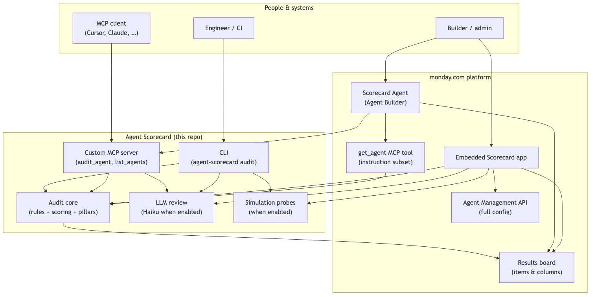
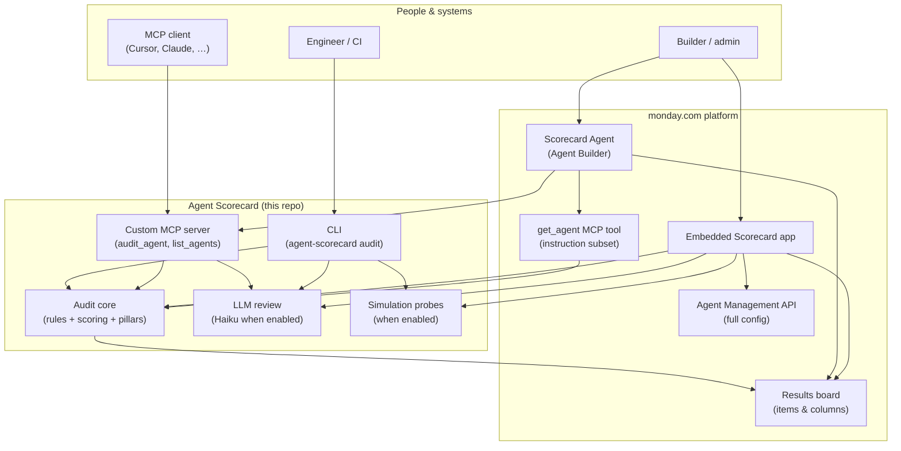
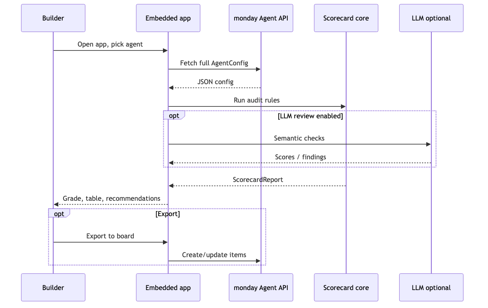
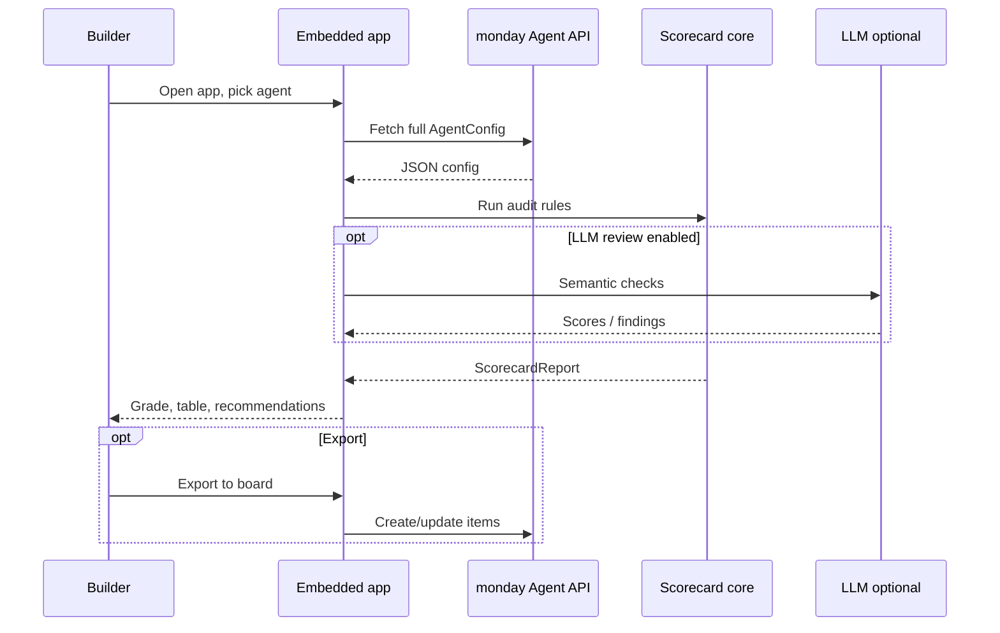
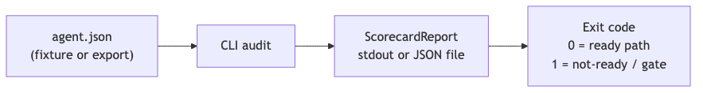
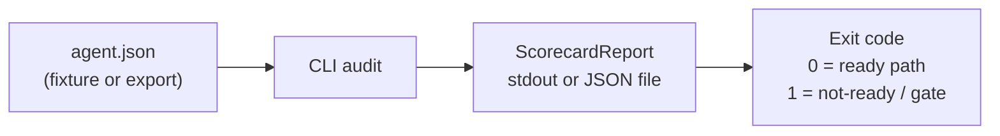
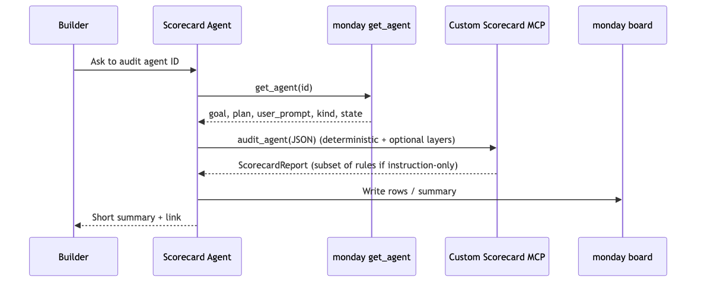
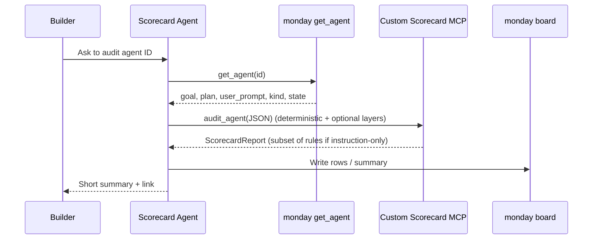

# Agent Quality Scorecard — Leadership brief

**Audience:** Executives and decision makers  
**Purpose:** What it is, why it matters, what exists today, roadmap, truthful metrics, architecture, and user flows.  
**How to use this file:** Copy into a [monday.com Doc](https://monday.com/) (or split into workdoc sections). Headings and tables paste cleanly.

**Cursor — Agent Evaluator canvas:** The **visual, read-in-one-pass** version of this brief (value proposition, executive risk lens and decisions to align, where you can use it in monday, Agent Builder + Custom MCP flow, limitations / next steps) lives in Cursor as a **Canvas**: open **`agent-scorecard-leadership.canvas.tsx`** from the **Canvases** list for this workspace, or from the managed canvases folder on disk (typically `~/.cursor/projects/<workspace-folder>/canvases/agent-scorecard-leadership.canvas.tsx` — exact path depends on your machine). Use **this markdown** when you need monday Doc paste, versioned diffs, or the PNG/Mermaid sources under [`docs/leadership-brief-diagrams/`](./leadership-brief-diagrams/).

**Standards deep dive:** For procurement, security, and regulatory framing, see [`STANDARDS_AND_VALUE.md`](./STANDARDS_AND_VALUE.md) (OWASP ASI Dec 2025, NIST AI RMF, multi-layer evaluation, scoring model). Roadmap tables, pilot KPI candidates, and user-flow diagrams **below** stay here for export; the Canvas summarizes the same threads for Cursor readers.

**Technical roadmap (engineering labels):** See [`ROADMAP.md`](./ROADMAP.md). *Note:* the shipped **product/library release** is **v2.0.0** (`package.json`, `CHANGELOG.md`). The roadmap file reuses version numbers for *later* themes (e.g. “org dashboard”); treat roadmap rows as **phases**, not the same as npm package semver, unless you align naming in a future edit.

---

## 1. What it is

**Agent Quality Scorecard** is a **configuration audit** for **monday.com Agent Builder** agents. It answers: *“Is this agent’s setup safe and complete enough to ship?”* using:

- **Deterministic checks** (keywords, structure, permissions, tools, triggers, vertical packs such as SLED grants).
- **Optional LLM review** (semantic checks, including multi-judge sampling on the highest-stakes safety items).
- **Optional simulation probes** (where the runtime can exercise the agent config — typically CLI / automation, not inside the in-product Agent Builder agent today).

**Outputs:** numeric score, letter grade **A–F**, deployment-style recommendation (`ready` / `needs-fixes` / `not-ready`), per-rule findings, fix guidance, and (where configured) rows on a monday board.

**Delivery surfaces today:**

| Surface | Who uses it | Config depth |
|--------|-------------|----------------|
| **Embedded monday app** | Builders inside monday | **Full** agent config (internal Agent Management API) |
| **CLI** | Engineers, CI pipelines | **Full** config from JSON file |
| **Custom MCP server** | Cursor, Claude, other MCP clients | Whatever JSON the caller supplies (often `get_agent` output or full config) |
| **Scorecard Agent** (Agent Builder) | Builders in chat | **Instruction-level** subset via public `get_agent` (see coverage table below) |

---

## 2. Why it’s valuable (decision-ready framing)

Summarized from [`STANDARDS_AND_VALUE.md`](../STANDARDS_AND_VALUE.md):

1. **Problem:** Customer-built agents often ship **without** a repeatable quality or security gate — risking hallucinations, leaks, injection, runaway automation, and (in regulated use cases) **contract or eligibility** exposure.

2. **Defensibility:** Checks are mapped to **recognized** frameworks — **OWASP Agentic Security Initiative (ASI, Dec 2025)**, **NIST AI RMF** (GOVERN / MEASURE / MANAGE via tiering, observability, reliability), and **adversarial** methodology aligned with industry practice (e.g. MITRE ATLAS–style thinking). That is the language **security, procurement, and auditors** already use.

3. **Risk-tiered, not one-size-fits-all:** **GOV-001** raises the bar for higher-autonomy agents (e.g. broader capability surface, account-level / external kinds). A “B” on a low-tier assistant is not the same decision as a “B” on a high-tier operator.

4. **Block-on-critical:** A single failed **critical** safety check forces **F** and **not-ready** — the score cannot hide a broken brake rail (CVSS / SSL Labs–style severity model; see standards doc).

5. **Vertical packs without re-architecture:** Example: **SLED grant** rules ship as a pack; other industries can add packs the same way.

### 2.1 Business risk lens (executives)

Three ways “no quality gate” shows up outside engineering:

| Lens | What is at stake |
|------|-------------------|
| **Revenue / deals** | Enterprise and regulated buyers increasingly expect **demonstrable** AI governance. A story that stops at “the builder is responsible” is a weak answer in procurement — it can slow renewals, block vertical expansion, and complicate security questionnaires. |
| **Liability / compliance** | Misconfigured agents can leak workspace data, over-automate, or give wrong authoritative answers. In regulated contexts (public funds, health-adjacent coordination, financial reporting), that surfaces as **contract**, **eligibility**, or **audit** exposure — not only “bad UX.” |
| **Platform trust** | Agent Builder’s value depends on customers trusting **fleet-scale** deployment. A high-profile failure (exfiltration, bad compliance guidance, runaway automation) can erode confidence **across** accounts, not only the affected workspace. |

### 2.2 Decisions to align (tradeoffs, not prescriptions)

These are **choices to make explicit** with platform, security, and field — not fixed answers from this repository:

| Area | What to decide | Tradeoffs / notes |
|------|----------------|-------------------|
| **Full config in Agent Builder** | Ship a **hosted or MCP bridge** that resolves the full agent record vs **wait** on a richer public `get_agent` (or other documented API) | Chat-side depth vs dependency on **supported** credentials, hosting, and review cycles |
| **Channel priority** | Weight **in-product Builder** vs **CI / export** vs **both** first | Builders feel friction first; governance often lives in pipelines — **same audit core** everywhere, so sequencing is mostly product and GTM |
| **Continuous evaluation** | **Scheduled** checks (e.g. poll + `version_id` / hash) vs lighter rollout until **lifecycle signals** exist | Coverage vs engineering noise; there is **no** official agent edit webhook called out in roadmap today |

Operating dependencies (MCP 500s, LLM variance, platform webhooks, access to management-class APIs) stay in **§3.4C**.

---

## 3. What we have today, roadmap, and business metrics

**Cursor:** For a single-screen walkthrough of roadmap themes, pilot KPI ideas, and how flows feel in-product, open the **Agent Evaluator** canvas (see the **Cursor — Agent Evaluator canvas** callout at the top of this doc).

### 3.1 Shipped capability (v2.0.0 — library / product)

Aligned with `CHANGELOG.md`, `README.md` audit rules section, and `STANDARDS_AND_VALUE.md`:

| Capability | Detail (truth-bound) |
|------------|----------------------|
| **Release** | **v2.0.0** (`package.json`) |
| **Deterministic rules (universal + SLED)** | **36** checks with `--vertical sled-grant` (32 universal + 4 SLED); fewer without vertical |
| **“Instruction-only” (v1) deterministic rules** | **15** rules (`pillar` set on `AuditRule`) evaluable from `get_agent` alone — the **deterministic** slice the Scorecard Agent runs; LLM checks are separate |
| **LLM review checks** | **9** optional checks in the full pipeline (`--llm-review`); **8** of 9 usable without KB file list (LR-004 needs KB filenames) |
| **Simulation** | **6** probes when enabled (`--simulate`); **not** part of the default Agent Builder agent flow |
| **Five pillars** | Completeness, Safety, Quality, Observability, Reliability (+ **GOV-001** tier modifier) |
| **Automated regression suite** | **401** passing tests across **40** test files (`npm test`, last verified at doc authoring time) |
| **Release quality gate** | `npm run verify` = TypeScript lint + Prettier + full tests + JSON schema validation of fixtures + spec drift check vs composed agent prompt |

### 3.2 Coverage by channel (sets expectations)

From [`STANDARDS_AND_VALUE.md`](../STANDARDS_AND_VALUE.md) (single source for stakeholder accuracy):

| Channel | Deterministic | LLM | Simulation |
|---------|----------------|-----|--------------|
| **CLI / embedded app** | **36** (full envelope) | **9** (optional) | **6** (optional) |
| **Scorecard Agent (Builder)** | **15** (pillar-tagged deterministic) | **8** of **9** | **0** |

Full-mode rules (tools, KB, permissions, triggers) require data **not** in the public `get_agent` response today.

### 3.3 Roadmap — higher fidelity (engineering phases)

Cross-walk: [`ROADMAP.md`](./ROADMAP.md). Names below are **themes**; align internal planning IDs as you prefer.

| Phase (roadmap) | Theme | What improves | Typical blocker |
|-----------------|--------|----------------|-----------------|
| **Full config in Agent Builder** (roadmap *v1.3*) | MCP proxy or expanded `get_agent` | Scorecard **Agent** runs **all 36** deterministic rules + **LR-004** with real tools/KB/permissions | Internal API auth / platform API |
| **Simulation in product** (roadmap *v1.4*) | Runtime probes | **Behavior**, not only instructions; full three-layer story in-product | Agent invocation API / safe harness |
| **Org-wide health** (roadmap “dashboard” row) | Batch + trends | “How is my org doing?” — rollups, schedules, degradation alerts | Account-wide enumeration + storage + rate limits |
| **Continuous evaluation** (roadmap *v2.1*) | Webhooks or polling | Auto-run on create/edit | **No agent lifecycle webhook** today; fallback = scheduled poll + `version_id` / hash |

### 3.4 Business metrics — rooted in truth

**A. Metrics we can state today (verified from the repository)**

These are **facts**, not adoption projections:

| Metric | Value | Source / how to reproduce |
|--------|--------|---------------------------|
| **Automated test count** | **401** tests, **40** files | `npm test` |
| **Pre-merge quality bar** | Lint + format + tests + fixture schema + prompt/spec sync | `npm run verify` |
| **Rule inventory (full audit)** | **36** deterministic with SLED vertical | `README.md` audit rules; `getRulesForVertical('sled-grant')` in code |
| **Instruction-only inventory** | **15** deterministic rules (`pillar` defined); see `instructionOnlyRuleIds()` in `src/mcp/public-api-mapper.ts` | Source of truth in code |
| **LLM checks (full pipeline)** | **9** | `src/llm-review/reviewer.ts` phase-1 list + Q-004 |
| **Estimated LLM cost per full LR pass** | **~US $0.02–0.04** per agent (order of magnitude) | `README.md` cost note; depends on Anthropic pricing and prompt size |
| **Composed Scorecard agent prompt size** | **~17.7k** characters at current ruleset | `tests/agent-builder/build-agent-prompt.test.ts` / `npm run gen:spec` output |

**B. Outcome metrics leadership usually wants — define during pilot (not invented here)**

We do **not** yet have production telemetry in this repo for the following; treat them as **KPI candidates** to instrument when you roll out:

| KPI candidate | Definition sketch | Notes |
|---------------|-------------------|--------|
| **Time-to-first-grade** | Minutes from “agent exists” to first scorecard | Needs workflow + tooling (app vs Agent vs CI) |
| **Critical escape rate** | % of agents with **any** failed critical check at audit time | Directly from `ScorecardReport` |
| **Remediation rate** | % of criticals cleared within *N* days of first audit | Needs identity + re-audit linkage |
| **Grade distribution** | Histogram of A–F by team / vertical | Aggregate from stored reports |
| **Cost of quality** | LLM spend + engineer time | Tie to `$0.02–0.04` per deep audit + human review of `lowConfidence` flags |

**C. Dependencies and risks (decision-useful)**

| Item | Impact on “expected performance” |
|------|-------------------------------------|
| **Public `get_agent` payload** | Instruction-level fields only for the Scorecard Agent path; tools, KB, permissions, and triggers require **management-class** or other **productized** access for full deterministic depth in chat — see **§2.2** and roadmap *v1.3*. |
| **monday agent MCP health** | When `get_agent` / `create_agent` return **500**, provisioning and in-chat fetch paths fail **regardless of scorecard logic** — other MCP tools can still work (isolate to agent subsystem). |
| **LLM non-determinism** | Semantic scores can vary slightly run-to-run; multi-judge + `lowConfidence` reduce false confidence — still a **review** surface for borderline cases. |
| **Platform gaps** | No official **agent lifecycle webhook** for auto-audit on every edit (see `ROADMAP.md`); org-wide and continuous themes depend on monday or **your** orchestration. |

---

## 4. High-level architecture

**PNG images (for monday Doc, Slides, or where Mermaid does not render):**  
[`docs/leadership-brief-diagrams/`](./leadership-brief-diagrams/) — `architecture.png`, `flow-a-embedded-app.png`, `flow-b-cli-ci.png`, `flow-c-scorecard-agent.png`. Source `.mmd` files and regenerate with `npx @mermaid-js/mermaid-cli` (see that folder’s `README.md`).

**Reading the diagram**

- **Audit core** is shared: same rules and scoring whether input comes from a file, the app, or MCP.
- **monday** supplies **data** (full config in app; instruction subset via `get_agent` for the Builder agent) and **presentation** (board items).
- **Anthropic** is only in the loop when **LLM review** (and some agent-in-Builder reasoning paths) is enabled.

---

## 5. User flows (very high level)

### Flow A — Embedded app (full fidelity)

### Flow B — CLI / CI (full fidelity, file-based)

Typical use: **pull request** or **release job** fails if grade or recommendation crosses your policy.

### Flow C — Scorecard Agent inside Agent Builder (instruction path)

**Note:** This flow needs **`get_agent`** and your **custom MCP** to be healthy; monday-side **500** errors on agent tools block step `get_agent` even when scorecard code is correct.

### Flow D — MCP-only consumer (integration / IDE)

1. Caller obtains **agent JSON** (from export, `get_agent` when working, or another system).  
2. Caller invokes **`audit_agent`** on the **custom** Scorecard MCP with that JSON.  
3. Caller receives **`ScorecardReport`** JSON — grades, layers, recommendations.

---

## 6. Suggested decisions for leadership

| Decision | Options / question |
|-----------|-------------------|
| **Primary channel** | Optimize for **embedded app** (builders), **CI** (governance), or **both**? |
| **Pilot KPIs** | Which of §3.4B will you instrument first (critical rate, time-to-grade, remediation)? |
| **Platform dependency** | Invest in **MCP proxy** for full config in Builder vs wait on **monday `get_agent` expansion**? |
| **Continuous coverage** | Accept **scheduled polling** until monday ships **webhooks**? |

---

## 7. References (repo)

| Document | Role |
|----------|------|
| [`STANDARDS_AND_VALUE.md`](../STANDARDS_AND_VALUE.md) | Standards alignment, buyer language, coverage by channel |
| [`ROADMAP.md`](./ROADMAP.md) | Phased technical evolution and blockers |
| [`CHANGELOG.md`](../CHANGELOG.md) | v2.0.0 shipped changes |
| [`AGENT_BUILDER_SETUP.md`](./AGENT_BUILDER_SETUP.md) | Operational setup for the Scorecard Agent |
| [`README.md`](../README.md) | Rule tables, CLI, MCP, cost note |

---

*Document generated for leadership consumption. Metrics in §3.4A reflect repository state; §3.4B is intentionally forward-looking and unfilled until you attach real pilot data.*
